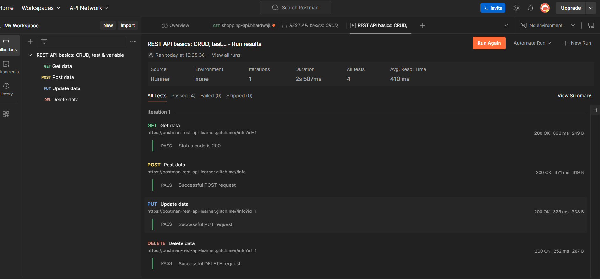

# Hono.js Shopping API

A lightweight Shopping API built with **Hono.js** and **TypeScript**, designed to perform CRUD (Create, Read, Update, Delete) operations on an in-memory data store. The API is deployed on **Cloudflare Workers** for fast, scalable, and serverless deployment.

## Table of Contents

- [Features](#features)
- [Live Demo](#live-demo)
- [Technologies Used](#technologies-used)
- [Endpoints](#endpoints)
- [Testing](#testing)
- [Screenshots](#screenshots)
- [License](#license)

---

## Features

- Perform CRUD operations for managing a list of items:
  - Create a new item
  - Retrieve existing items
  - Update an item
  - Delete an item
- Built with **Hono.js** for simplicity and performance.
- Developed using **TypeScript** for type safety and enhanced development experience.
- Deployed on **Cloudflare Workers** for fast and scalable API access.

---

## Live Demo

Test the API using the following live link:  
**[Deployed API Endpoint](#)** *(https://shopping-api.bhardwajlaughterclub.workers.dev/listing)*

You can use tools like **Postman** or **cURL** to interact with the API.

---

## Technologies Used

- **Hono.js**: Lightweight web framework for fast APIs.
- **TypeScript**: For type safety and better developer experience.
- **Cloudflare Workers**: Serverless deployment platform.

---

## Endpoints
For 
### Base URL:  https://shopping-api.bhardwajlaughterclub.workers.dev/listing  

- GET ALL Listed Items [GET /listing]
- GET One Listed Item using ID [GET /listing/:id]
- CREATE a Listing [POST /listing]
- UPDATE Listed Item [PUT /listing/:id]
- DELETE Listed Item [DELETE /listing/:id]

- ---
**POSTMAN CHECK

